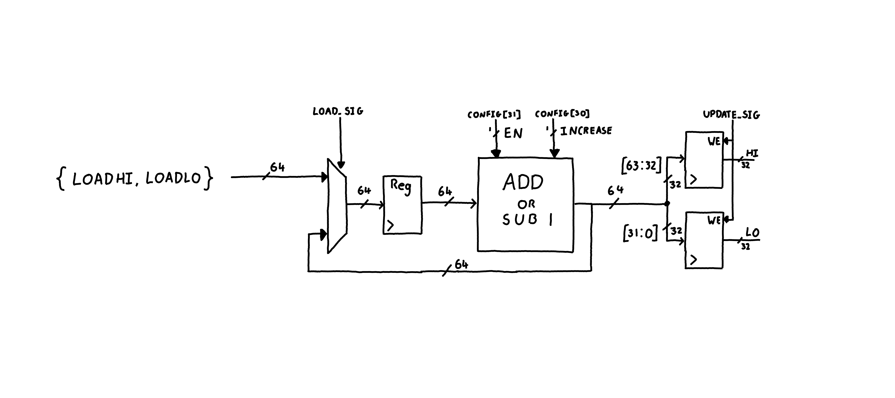
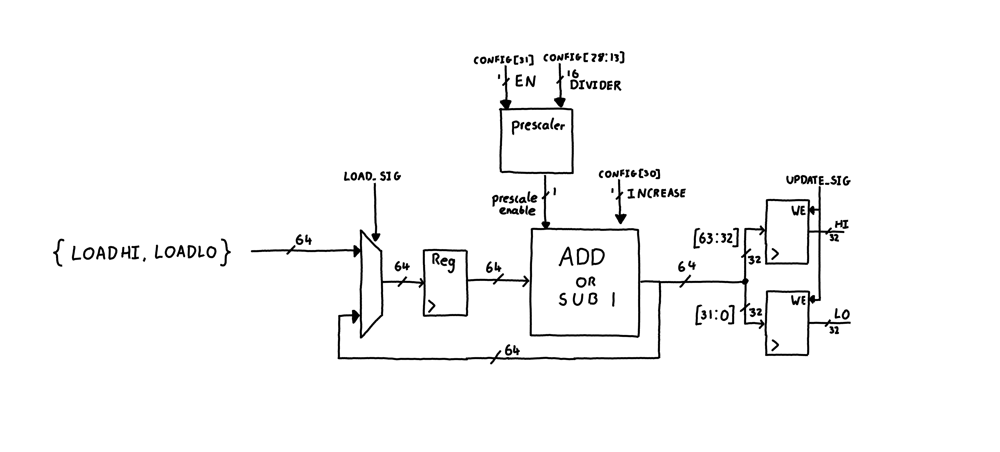

# EmSys Lab 5: ESP32 Timer and Verilog Timer 

In this lab you will write some code that will interact with some of the ESP32 hardware timer peripherals. You will then describe a hardware timer in Verilog and simulate it. You must complete the following tasks for this lab, each of which is broken down to a few steps:

* [__Task 1__] configure one of the hardware timer peripherals on the ESP32 device.
	* Step 1: implement ``setupTimer()``.
	* Step 2: implement ``resetTimer()``.
	* Step 3: implement ``readTimer()``.
* [__Task 2__] construct the hardware and MMIO interface for one of the ESP32 hardware timers in Verilog.
	* Step 1: write the software portion for the hardware simulation.
	* Step 2: describe the hardware timer (without the prescaler).
	* Step 3: add the prescaler to the timer.

The steps for each task do not need to be submitted separately. They are there more a guide for how to go about completing the tasks.

## Task 1: Configuring an ESP32 hardware timer

In your GitHub logbook repository you should have the following directory: ``lab5/task1/task1.ino``. In this folder there is a partially completed sketch for your __TinyPico__ device for configuring a hardware timer module.

You will have to complete three functions, ``setupTimer``, ``resetTimer``, and ``readTimer`` to complete this task. In each of these functions you will use the hardware memory-mapped registers at the top of the file to configure the bits of the timer and complete the functions.

The only thing that you need to commit to your logbook for this task is the completed sketch ``lab5/task1/task1.ino``.

__For information on how the hardware timer module operates please watch the following mini lecture [[COMMING SOON TO A REPO NEAR YOU]()].__ 

For this task you will be configuring the hardware timer module 0 in timer group 0. Information on these timers can be found the ESP32 [[Technical Reference Manual](https://www.espressif.com/sites/default/files/documentation/esp32_technical_reference_manual_en.pdf)] page 498. In the technical reference manual (TRM) there is details on the operation of the timer and of the individual registers that you need to read and write to in order to configure it. For the timer that we will be configuring in this lab the table below details the registers that you will need to interact with. For each register, a TRM reference is given, this is the reference that you can use to look up more details of that register in the technical reference manual.

|   Register   |     Name   |    TRM reference  |   Info |
|--------------|------------|-------------------|--------|
| 0x3FF5F000   |   CONFIG   |    18.1           | Used to configure the timer | 
| 0x3FF5F004   |   LO   |    18.2           | Bottom 32-bits of the timer value | 
| 0x3FF5F008   |   HI   |    18.3           | Top 32-bits of the timer value | 
| 0x3FF5F00C   |   UPDATE   |    18.4           | __Any__ write to this register stores the current timer value in HI and LO | 
| 0x3FF5F018  |   LOADLO   |    18.7           | Value to load onto the bottom 32 bits of the counter | 
| 0x3FF5F01C  |   LOADHI   |    18.8           | Value to load onto the top 32 bits of the counter | 
| 0x3FF5F020  |   LOAD   |    18.9           | __Any__ write to this triggers LOADLO and LOADHI to be written into the counter | 

---------------------------------------------------------------------------------

### Step 1: ``setupTimer``

The ``setupTimer`` function performs the following tasks:
* Enables the timer by setting the EN bit of the CONFIG register.
* Sets the timer to increase it's count by setting the INCREASE bit of the CONFIG register.
* Sets the DIVIDER bits of the CONFIG register to configure the clock prescaler with the function input argument ``uint16_t divval``.

__You do not need to worry about your timer generating an alarm__. This means that bits ``EDGE_INT_EN``, `LEVEL_INT_EN``, and ``ALARM_EN`` of the configuration register should all be set to 0.

### Step 2: ``resetTimer``
The ``resetTimer`` function resets the timer value so that it starts counter again from a known point. To do this it needs to:
* Write the lower 32 bits that need to be loaded into the counter into the LOADLO register. 
* Write the upper 32 bits that need to be loaded into the counter into the LOADHI register. 
* Perform __any__ write operation on the LOAD register to load {LOADHI, LOADLO} into the counter.

### Step 3: ``readTimer``
The ``readTimer`` function returns a 64 bit unsigned number (``uint64_t``) that contains the current value of the timer. To do this it needs to do the following:
* Save the current counter value into the LO and HI registers. The hardware timer will do this when __any__ write occurs on the UPDATE register.
* Use the LO and HI registers to get the bottom 32 and upper 32 bits of the counter and return it.

### Step 4: Checking it is working correctly
In the loop function we have the following code:
```C
void loop() {
	resetTimer();
	delay(1000);
	displayTimer();
}
```

The ``displayTimer()`` function displays the bottom 32 bits of the timer counter value, obtained from the ``readTimer`` function, over serial. The timer count that you see should correspond to the 1000ms delay caused by ``delay(1000);`` make sure that the value you observe makes sense to ensure that your timer is configured correctly. It should be almost 1s, in reality I find it is slightly lower, like 0.9999985 seconds. __NOTE: pay attenting to the prescaler clock divider value that is passed into the ``timerSetup`` in the ``setup()`` function__.

## Task 2 : designing a hardware timer peripheral in Verilog

In this task you will design a memory-mapped hardware peripheral in Verilog. It will have same interface as the one you configured in Task 1. You will have to describe the hardware module in Verilog and you will be able to alter the C code that interacts with it from software.  

The directory for this task is ``lab5/task2``, of your GitHub logbook repository. In this directory you will see a few files:
* ``sw_driver.h`` - this is where you will put your Arduino-like software code that simulates the code running on the ESP32 that can interact with the hardware that you'll be building.
* ``timer.sv`` - this is where you will put your hardware description of your timer peripheral that the software you write in ``sw_driver.h`` will interact with.
* ``Makefile`` - used for building the hardware and software simulation and running it. You should not have to edit this file.
* ``.build_files`` - "hidden" files that are used for the simulation. You should not have to edit any files in this directory.

To compile and run the hardware software simulation type the following in the directory ``lab5/task2``:

```
make
```

Let's build up the hardware timer peripheral, and the software to drive it step by step.

### Step 1: Setting up the software

In ``sw_driver.h`` we can define the software that will interact with our hardware peripheral. This is setup in a very similar way to the software that you just used on the TinyPico with some subtle differences that I'll explain now. If you scroll down to the bottom you'll see the ``setup()`` and ``loop()`` functions:

```C
uint32_t i;

// runs once on startup
void setup() {
    i=0;
    setupTimer(2); 
}


// runs continuously
void loop() {
    resetTimer();
    delay(50); // remember this is not in miliseconds but clock cycles 
    displayTimer();

    if(i < 10)
       i = i + 1;
    else
       exit();
}
```

This should look pretty close to what you saw in task 1. 
* We setup the timer in the ``setup()`` function, by calling ``timerSetup()``.
* In the loop we reset the timer by calling ``resetTimer()``.
* In the loop we then delay the software execution for a bit by calling ``delay(50)``. However, unlike the ``delay()`` function on the ESP32 this function will not delay the simulation by that many milliseconds, instead it delays it by that many clock cycles of the simulation.
* We then print the timer value with ``displayTimer()``.
* Finally, we end the simulation by calling ``exit()``.

__In this step your task is to reimplement the ``setupTimer()``, ``resetTimer()``, and ``readTimer()`` functions in exactly the same way as in the task in ``sw_driver.h``__ 

__There is one other small change__ that you need to make! Unfortunately, for the simulation, pointers to memory mapped locations wont work. Instead we need to use the ``readReg()`` and ``writeReg()`` functions to interact with our hardware registers.

Let's say that we want to read the configuration register of our timer peripheral, which is at address ``0x3FF5F000``. To read a memory-mapped hardware register in ``sw_driver.h`` we can do the following:
```C
uint32_t hw_reg_value = readReg(0x3FF5F000);
```

The variable ``hw_reg_value`` should now contain the contents of the configuration register (if the hardware has been implemented correctly). The ``uint32_t`` is type that says that this is a 32-bit unsigned integer, we can also use ``uint64_t`` for 64-bit unsigned integers, ``uint16_t`` for 16 bit, and ``uint8_t`` for 8-bit. 

In ``sw_driver.h`` you'll find that some variables have already been created for the same memory addresses we used in task 1. So instead of the code above to read a register we could also write.
```C
uint32_t hw_reg_value = readReg(timg0_t0config_reg);
```
To get the same result.

Now, say we want to write to bit 0 of the configuration register. Instead of using a pointer in the simulation we have to use the ``writeReg()`` function. We can write to the register in the following way.
```C
regWrite(timg0_t0config_reg, 1);
```

Great, now that you know how to read and write to registers, reimplement your functions for ``setupTimer()``, ``resetTimer()``, and ``readTimer()`` in ``sw_driver.h``.

__Note: typing ``make`` to test your functions wont work yet as the timer hardware has not yet been fully implemented in ``timer.sv`` that is the next steps.__

### Step 2: Hardware timer without prescaler

The next step is to start constructing the hardware timer in ``timer.sv`` that the software you just wrote in the previous step will interact with. 

In ``timer.sv`` you will the ports list for our module along with some logic that is used for creating a memory-mapped hardware interface. __This interface is described in the following video that I highly recommend that you watch [[here](https://www.youtube.com/watch?v=gax3yg27doc&t=1s)].

Some of the registers have already been defined. For instance, the configuration register, let's walk through that register now. Beneath the ports list we can see that the signal for that register has been defined.
```v
logic [31:0] config_reg;
```
When we write to this register the ``wr_in`` signal is high, the address signal (``addr_in``) is set to ``0x3FF5F000``, and the data we are writing is contained in ``data_in``. In the write interface we first check the top 16 bits of the address and the write signal with an if statement on [[line 37](https://github.com/STFleming/emsys_21A_lab5/blob/c5b217db57fb7257963cd7d5dfacf459ce8b972e/task2/timer.sv#L37)].

```v
        if ((addr_in[31:16] == 16'h3FF5) & wr_in) begin
```

We do this to reduce the size of the case statement and it's likely that the top 16 bits of address are going to be the same for all our hardware peripherals. If this is true we can then enter our case statement where we can check the bottom 16-bits of our address. If the bottom 16 bits are ``0xF000`` then we have the right address for the configuration register and we can perform the write operation putting the ``data_in`` contents into that register, you can see this on [[line 41](https://github.com/STFleming/emsys_21A_lab5/blob/c5b217db57fb7257963cd7d5dfacf459ce8b972e/task2/timer.sv#L41)]. 

```v
       // config register write
       16'hF000: config_reg <= data_in;
```

It's a similar story for reading the configuration register. In the read interface logic, on [[line 63](https://github.com/STFleming/emsys_21A_lab5/blob/c5b217db57fb7257963cd7d5dfacf459ce8b972e/task2/timer.sv#L63)], we first check for the top-bits of the address and the ``rd_in`` signal, like we did in the write case, see [[line 66](https://github.com/STFleming/emsys_21A_lab5/blob/c5b217db57fb7257963cd7d5dfacf459ce8b972e/task2/timer.sv#L66)]. 

If that matches we then check the bottom bits to determine the correct register to read from. For the configuration register, if the bottom bits of the address are ``0xF000`` then we want to assign ``data_out`` the contents of the ``config_reg`` signal, as seen on [[line 70](https://github.com/STFleming/emsys_21A_lab5/blob/c5b217db57fb7257963cd7d5dfacf459ce8b972e/task2/timer.sv#L70)].



__In this step you need to create the 64-bit timer module that is compatible with the software that you wrote in the previous step. However, for this first task you can ignore the clock prescaler, just imagine that it is always set to 0.__ 

Above is a sketch for what your hardware _could_ look like. At the center, we have a unit which I have given the name ADD_OR_SUB. This unit examines the enable bit of the configuration register, EN, and if it is high it either adds 1 or subtracts 1 from the input depending on the value of the INCREASE configuration bit. 

The input to the ADD_OR_SUB module is the output of a 64-bit register that holds the current counter value. The input to the 64-bit register is either, the output of the ADD_OR_SUB module, or the values of LOADHI and LOADLO depending on if a LOAD operation has been triggered. 

In the timer module there are some registers that are not used for values, but to trigger an action. One example is the LOAD register. Whenever __any__ write operation is performed on this register it loads the value in LOADHI and LOADLO into the 64-bit counter. This is slightly different to the configuration register we discussed above, so I have included another example in ``timer.sv`` to demonstrate this. 

On [[line 29](https://github.com/STFleming/emsys_21A_lab5/blob/c5b217db57fb7257963cd7d5dfacf459ce8b972e/task2/timer.sv#L29)] there is a load_triggered signal, which I want to remain high for one clock cycle to trigger the loading event when the LOAD register is written to.

```v
logic load_triggered;
```

In the write process, I have a default condition that sets the ``load_triggered`` signal to 0 every clock edge, see [[line 35](https://github.com/STFleming/emsys_21A_lab5/blob/c5b217db57fb7257963cd7d5dfacf459ce8b972e/task2/timer.sv#L35)]. 
```v
// write interface logic
always_ff @(posedge clk) begin

        // default
        load_triggered <= 1'b0;
```

However, if a write to the LOAD address is detected, this assignment is temporarily overwritten until the write completes, see [[line 45](https://github.com/STFleming/emsys_21A_lab5/blob/c5b217db57fb7257963cd7d5dfacf459ce8b972e/task2/timer.sv#L45)]. 

```v
        // Trigger a load
        16'hF020: begin
                load_triggered <= 1'b1;               
        end
```

The final part of the hardware is the registers that stores the top 32-bits, HI, and bottom 32-bits, LO, of the counter value. These values are saved whenever _any_ write occurs to the UPDATE register, so they will likely need to be write enabled based on some sort of update signal that is similar to the ``load_triggered`` signal I discussed above. 

__Your task in this step of the lab is to describe the hardware above using Verilog in the ``timer.sv`` file. It should work with the software that you wrote in the previous step to count the number of clock cycles for the ``delay()`` function call.__

This might seem like a daunting task, but it will be okay if you take it step by step. I recommend starting with reading and writing to the configuration register and examining the outputs on gtkwave to see how the register is being written to and going from there.

### Step 3: Hardware timer with prescaler


The final step is to add the prescaler to the hardware timer peripheral. This prescaler controls the rate at which the counter increments based on the setting of the DIVIDER bits in the CONFIG register for the timer. How I would develop this, is to create a prescaler unit that has a counter built that pulses a signal, which I have called prescale_enable, that only enables the ADD_OR_SUB module every N clock cycles. However, there are a few ways to add the prescaler, so don't feel restricted by my approach. 

When your hardware is completed you should see the following output for the timer values when ``setupTimer(4)`` and ``delay(100)`` are used in ``sw_driver.h``. __Note there might be some slight differences between readings due to the asynchronous way that the SW simulator and HW simulator communicate.__

```
-- RUN ---------------------
obj_dir/Vtop_tb +trace
[1] Tracing to logs/vlt_dump.vcd...

[1] Model running...

Timer=24
Timer=25
Timer=25
Timer=25
Timer=25
Timer=25
Timer=25
Timer=25
Timer=25
Timer=25
Timer=25

```

When ``setup(2)`` and ``setup(1)`` and ``delay(100)`` you should see the following output for the timer values:
```
-- RUN ---------------------
obj_dir/Vtop_tb +trace
[1] Tracing to logs/vlt_dump.vcd...

[1] Model running...

Timer=48
Timer=50
Timer=50
Timer=50
Timer=50
Timer=50
Timer=51
Timer=50
Timer=50
Timer=50
Timer=50

```
